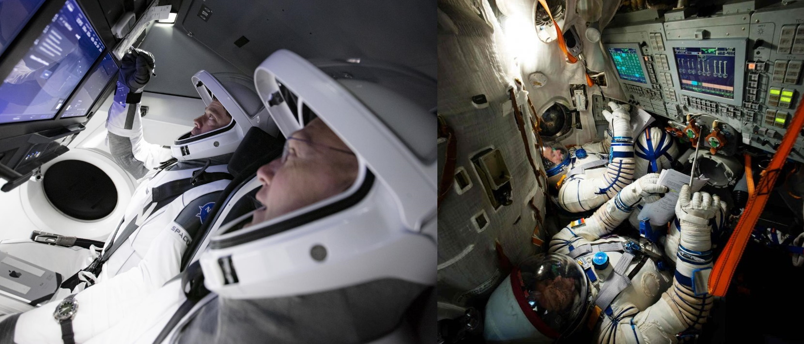

 ## NFC-Implantat ##
Mit einem NFC-Chip, der üblicherweise in die Hand implantiert wird, ist es sogar heutzutage schon möglich viele Dinge wie den Haustürschlüssel, die Kreditkarte oder Tickets und Eintrittskarten für Bus und Bahn oder das Fitnessstudio zu ersetzen. Außerdem kann man seine Kontaktdaten, quasi eine "digitale Visitenkarte" darauf speichern. In Zukunft könnte es für Sanitäter und Ärzte hilfreich sein medizinische Daten wie die eigene Blutgruppe, welche Medikamente man einnimmt oder Erkrankungen auf dem Implantat zu hinterlegen, um im Notfall schnell darauf zugreifen zu können. Falls sich diese Technologie durchsetzen sollte, kann ich mir gut vorstellen, dass in fünf bis zehn Jahren nahezu alle im Alltag vorkommenden Identifikations- und Autorisierungsverfahren über einen NFC-Chip laufen könnten.

Quellen: https://www.vimpay.de/blog/die-technik-der-zukunft-geht-unter-die-haut/   https://financefwd.com/de/payment-chip-implantat-digiwell/

 ## Social Robots ##
Aufgrund der immer schnelleren Fortschritte in der Robotik durch Technologien wie Machine Learning und künstlicher Intelligenz werden Roboter zunehmend intelligenter und immer menschenähnlicher. In der Industrie sind sie schon lange Standard, doch in unsere privaten Haushalte haben es bisher nur Spielzeugversionen der Roboter geschafft. Dies könnte sich allerdings in den nächsten Jahren bereits schon ändern. Ob im Alltag, bei der Betreuung von Kindern und Kleinkindern oder bei der Pflege von Senioren - ein intelligenter Roboter kann vielfältig eingesetzt werden. In einigen Pflegeheimen sind bereits Prototypen von Pflegerobotern im Einsatz und Entlasten die Pflegekräfte so gut es geht. 

Quelle: https://www.haz.de/Hannover/Aus-der-Stadt/Testprojekt-mit-Roboter-Pepper-Sieht-so-die-Zukunft-der-Pflege-aus

## Crew Dragon ## 
Am 30.05.2020 startete das erste Mal eine bemannte Crew Dragon-Kapsel des US-amerikanischen Raumfahrtunternehmens SpaceX und machte sich auf den weg zur internationalen Raumstation ISS. Damit wurde ein weiterer Meilenstein in der bemannten Raumfahrt erzielt, denn noch nie zuvor wurden Persoen von einem privaten Raumfahrtunternehmen ins All geschossen. Vergleicht man das Interface der alten Raumschiffe, mit denen bis heute noch Astronauten ins All befördert werden, merkt man, wie groß der Schritt in die Zukunft ist, den Space mit seiner Crew Dragon gemacht hat. Denn die Technologie der Sojus-Kapsel, mit der die NASA bisher Astronauten zur ISS gebracht hat, wurde größtenteils schon in den 60er-Jahren entwickelt.
Die Crew Dragon ist in der Lage komplett selbstständig zur ISS zu navigieren. Die im Cockpit verbauten Touchdisplays sind hauptsächlich da um wichtige Informationen rund um den Flug zu erhalten. Dennoch kann die Crew Dragon im Notfall über die Touchscreens manuell gesteuert werden.

Quellen: https://www.space.com/spacex-crew-dragon-touchscreen-astronaut-thoughts.html   https://www.esa.int/ESA_Multimedia/Images/2014/10/Andreas_and_Gennady_during_training
