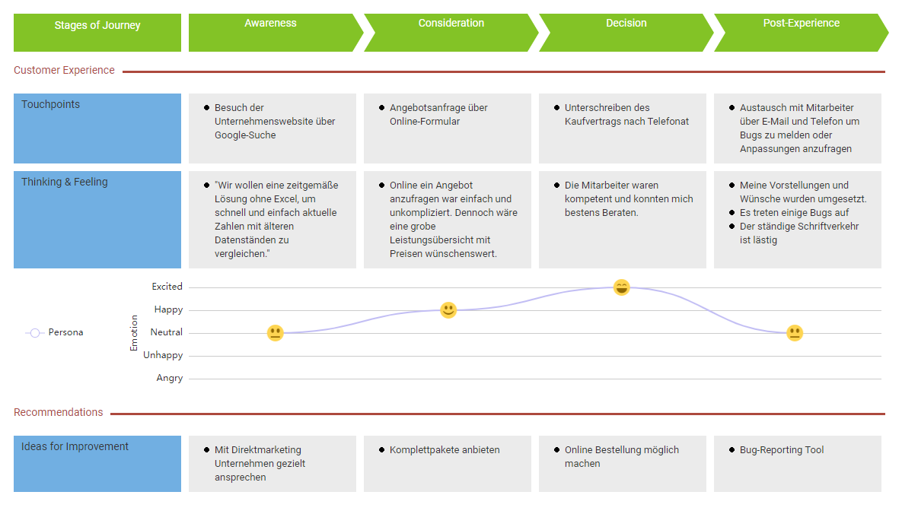
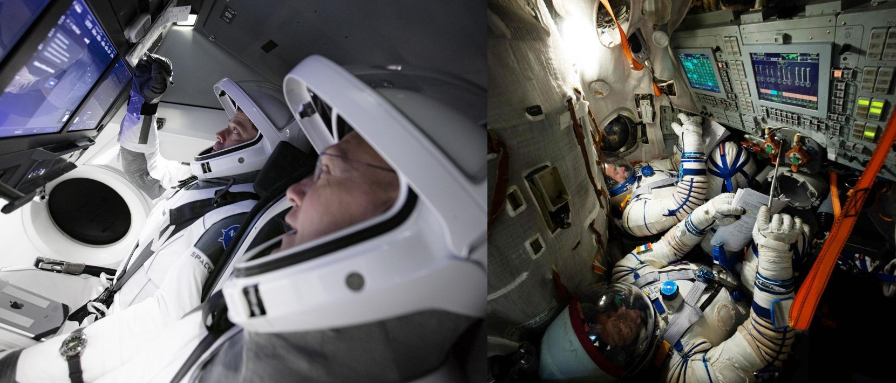

 ## Customer Journey Map ##

Um eine Customer Jouney Map anzufertigen bin ich davon ausgegangen, dass das Produkt bei einer Web-Agentur angefragt wird. Diese Agentur übernimmt dann die Erstellung eines Programms, welches genau zu den Anforderungen passt.

 ## Empirischer Nutzertest ##

## Prototyp Enhancement ## 
Am 30.05.2020 startete das erste Mal eine bemannte Crew Dragon-Kapsel des US-amerikanischen Raumfahrtunternehmens SpaceX und machte sich auf den weg zur internationalen Raumstation ISS. Damit wurde ein weiterer Meilenstein in der bemannten Raumfahrt erzielt, denn noch nie zuvor wurden Persoen von einem privaten Raumfahrtunternehmen ins All geschossen. Vergleicht man das Interface der alten Raumschiffe, mit denen bis heute noch Astronauten ins All befördert werden, merkt man, wie groß der Schritt in die Zukunft ist, den Space mit seiner Crew Dragon gemacht hat. Denn die Technologie der Sojus-Kapsel, mit der die NASA bisher Astronauten zur ISS gebracht hat, wurde größtenteils schon in den 60er-Jahren entwickelt.
Die Crew Dragon ist in der Lage komplett selbstständig zur ISS zu navigieren. Die im Cockpit verbauten Touchdisplays sind hauptsächlich da um wichtige Informationen rund um den Flug zu erhalten. Dennoch kann die Crew Dragon im Notfall über die Touchscreens manuell gesteuert werden.

Quellen: https://www.space.com/spacex-crew-dragon-touchscreen-astronaut-thoughts.html   https://www.esa.int/ESA_Multimedia/Images/2014/10/Andreas_and_Gennady_during_training
