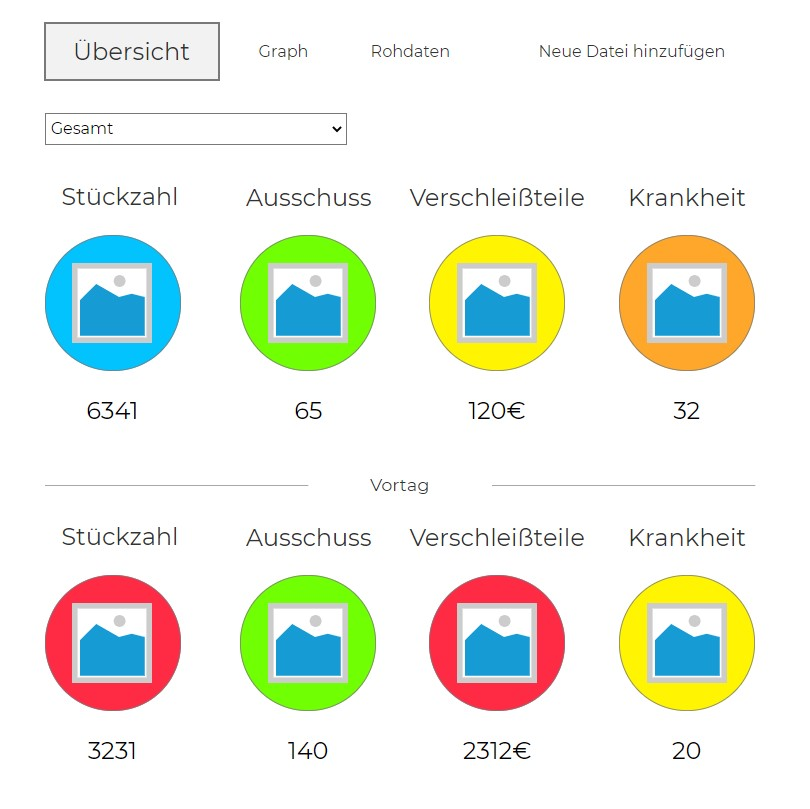

 ## Customer Journey Map ##

Um eine Customer Jouney Map anzufertigen bin ich davon ausgegangen, dass das Produkt bei einer Web-Agentur angefragt wird. Diese Agentur übernimmt dann die Erstellung eines Programms, welches genau zu den Anforderungen passt.

 ## Empirischer Nutzertest ##

1. Zielgruppenbestimmung:
 Die Zielgruppe für dieses Produkt ist relativ groß. Es sind alle Mitarbeiter der Firma die m
 
 Für meinen Nutzertest habe ich 4 Personen unterschiedlichen alters und Geschlecht ausgewählt. Ich habe den Probanten drei Aufgaben gestellt die es während des Tests zu erledigen gilt. Des weiteren habe ich um ihr Feedback und ihre Eindrücke zum Prototyp gebeten.
 
 Aufgabe 1: Wie viele Krankmeldungen gab es heute?
 Aufgabe 2: Wie hoch war die produzierte Stückzahl am 18.05.2020?
 Aufgabe 3: Laden sie die aktuelle Exel Datei in das Programm.

Person eins erledigt die gestellten Aufgaben innerhalb von ca. 2,5 Minuten. Nach einer kurzen Eingewöhnungszeit war er schon relativ sicher im Umgang mit dem Programm. Es war schnell klar, wofür die einzelnen Funktionen und Darstellungsformen stehen. Er merkt an, dass die genutzten Farben, um die Produktionszahlen darzustellen, sehr kindlich aussehen.

Person zwei erledigt die gestellten Aufgaben in weniger als einer Minute. Sie merkt, an das Programm sei übersichtlich und man finde sich schnell zurecht. Auch auf sie wirkt die farbenfrohe Übersichtsseite unprofessionell. Die vielen Ankreuzkästchen auf der Graph-Unterseite empfindet die Testperson als umständlich.

Person drei schaffte lediglich Aufgabe 1. Ihm war nicht klar, dass er nicht alle Daten der Startseite entnehmen konnte. Außerdem konnte er mit der Drag and Drop Funktion bei „Neue Datei hinzufügen“ nicht umgehen. Mit etwas Hilfe gelang es ihm dann die Aufgaben 1 und 2 zu erledigen. Ihm gefällt die große Schrift und die übersichtliche Darstellung.

Person vier schaffte es die Aufgaben in weniger als zwei Minuten zu erledigen. Sie findet, dass eine sehr große Schriftart gewählt wurde und die Darstellung allgemein sehr grob wirkt. Sie merkt an, dass mit einer kleineren Darstellung mehr Information auf der Startseite untergebracht werden könne. Die Aufteilung in Übersicht, Graph und Rohdaten erscheint ihr sinnvoll.

### Top-Findings ###
1. Fraben zu kindlich, wirkt unprovessionell
2. Ankreuzkästchen auf Graph-Unterseite zu umständlich
3. Drag and Drop nicht selbsterklärend
4. Zu grobe Darstellung

## Prototyp Enhancement ## 

Mit Hilfe des Nutzertests ist mir schnell klar geworden wo es an meinenm Prototypen noch verbesserungspotential gibt. Ich habe mich dazu entschieden die Farbgebung auf der Startseite nicht so stark in den Mittelpunkt zu stellen und dafür kleinere Elemente zu wählen. Daruch hatte ich mehr Platz um auf der Startseite mehr interessante Informationen unterbringen zu können. Außerdem habe ich die Darstellung auf der Unterseite "Graph" angepasst. Alle Werke werden im Selben Diagramm dargestellt und man muss nur noch den gewünschten Parameter auswählen, was die Funktion benutzerfreundlicher macht. Ich habe mich dagegen entschieden auf die Probleme von Person drei einzugehen, da eine kurze einweisung in das Programm schon ausreicht um diese Probleme vorzubeugen.

https://f4vzeg.axshare.com/#id=hwe6jg&p=overview
